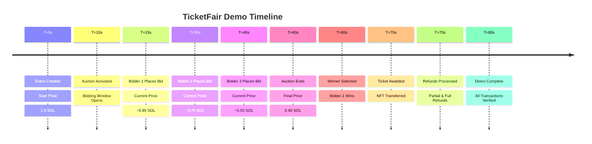

# TicketFair Live Demo Guide

This demo showcases the complete TicketFair workflow running on Solana devnet, demonstrating Dutch auction mechanics, bid placement, winner selection, and automatic refunds.

## 🎯 Demo Overview

**Scenario**: Single ticket Dutch auction with real-time bidding
- **Duration**: 60 seconds
- **Price Range**: 1.0 SOL → 0.1 SOL (linear decline)
- **Bidders**: 3 participants
- **Bid Times**: 15s, 30s, 45s into auction
- **Outcome**: Winner gets ticket + refund, losers get full refunds

## 🚀 Quick Start

### 1. Check Dependencies
```bash
./check-demo-deps.sh
```

### 2. Run the Demo
```bash
./demo-ticketfair-workflow.sh
```

### 3. Watch the Presentation
```bash
# Install Marp CLI for presentation
npm install -g @marp-team/marp-cli

# Generate presentation
marp presentation.md --output presentation.html
open presentation.html
```

## 📋 What the Demo Demonstrates

### ✅ Real Blockchain Transactions
- All operations execute on Solana devnet
- Verifiable on Solana Explorer
- No mocks or simulations

### ✅ Dutch Auction Mechanics
- Price declines linearly over time
- Real-time price calculation
- Fair price discovery mechanism

### ✅ Multiple Bidder Support
- Concurrent bid placement
- Different price points
- Proper bid validation

### ✅ Winner Selection & Awards
- Automatic winner determination
- NFT ticket transfer
- Proper account state management

### ✅ Refund Processing
- Partial refunds to winners (excess amount)
- Full refunds to losing bidders
- Automatic and trustless execution

## 🔧 Demo Architecture

### Script Components
```
demo-ticketfair-workflow.sh
├── setup_demo()           # Configure environment
├── create_demo_accounts()  # Fund wallets
├── create_auction_event()  # Create & activate event
├── run_live_auction()     # Execute auction with bids
├── finalize_and_award()   # Select winner & award ticket
├── process_refunds()      # Handle all refunds
└── generate_demo_summary() # Create results report
```

### Real-Time Components
- **Price Monitor**: Updates current auction price every 10 seconds
- **Bid Placer**: Places bids at predetermined times
- **State Tracker**: Monitors all account states
- **Transaction Logger**: Records all operations with Explorer links

## 📊 Expected Demo Flow



## 🎬 Demo Script Features

### Interactive Display
- **Colored Output**: Clear visual feedback
- **Progress Indicators**: Real-time status updates
- **Explorer Links**: Direct links to all transactions
- **Error Handling**: Graceful failure management

### Comprehensive Logging
- **Demo Directory**: All artifacts saved with timestamps
- **Transaction Log**: Complete record of all operations
- **Account States**: Before/after comparisons
- **Summary Report**: Markdown summary with links

### Validation Checks
- **Program Health**: Verify deployment status
- **Account Creation**: Confirm wallet funding
- **Transaction Success**: Validate all operations
- **State Consistency**: Verify expected outcomes

## 📁 Demo Outputs

After running the demo, you'll find:

```
demo-YYYYMMDD-HHMMSS/
├── demo.log                    # Complete execution log
├── demo-accounts.json          # All account addresses
├── DEMO-SUMMARY.md            # Results summary
├── create-organizer.ts        # Organizer creation script
├── create-bidders.ts          # Bidder creation scripts
├── create-event.ts            # Event creation script
├── place-bid-1.ts             # Bid placement scripts
├── place-bid-2.ts
└── place-bid-3.ts
```

## 🔗 Explorer Links

All demo transactions are viewable on Solana Explorer:
- **Program**: https://explorer.solana.com/address/3XCMusDvagK9wyRaHEMbrhLPQfFQPXhQXZZ7oZ2pr2ah?cluster=devnet
- **Event Accounts**: Generated during demo execution
- **Transaction Signatures**: Provided in real-time output

## 🎯 Presentation Integration

The demo is designed to be run during the Marpit presentation:

### Slide Integration Points
1. **Before Technical Architecture**: Run dependency check
2. **During Live Demo Section**: Execute full demo
3. **After Demo Results**: Show Explorer links and artifacts
4. **Q&A Section**: Reference demo logs and summaries

### Timing Considerations
- **Setup Time**: ~30 seconds
- **Demo Execution**: ~90 seconds
- **Results Review**: ~30 seconds
- **Total Time**: ~2.5 minutes

## 🔧 Troubleshooting

### Common Issues

#### Demo Script Fails
```bash
# Check dependencies
./check-demo-deps.sh

# Verify program deployment
solana program show 3XCMusDvagK9wyRaHEMbrhLPQfFQPXhQXZZ7oZ2pr2ah

# Check network connectivity
curl -s https://api.devnet.solana.com -d '{"jsonrpc":"2.0","id":1,"method":"getHealth"}' -H "Content-Type: application/json"
```

#### Insufficient SOL for Demo
```bash
# Request additional devnet SOL
solana airdrop 2
```

#### TypeScript Client Issues
```bash
# Regenerate client
npx tsx create-codama-client.ts

# Verify generation
ls -la dist/js-client/
```

### Error Recovery
The demo script includes comprehensive error handling:
- Automatic cleanup of background processes
- Graceful exit on user interruption (Ctrl+C)
- Detailed error messages with suggested fixes
- Complete logging for post-demo analysis

## 📈 Success Metrics

A successful demo will show:
- ✅ All transactions confirmed on devnet
- ✅ Price calculations mathematically correct
- ✅ Winner selection logic working properly
- ✅ Refund amounts precisely calculated
- ✅ All Explorer links functional
- ✅ Demo summary generated with complete data

## 🎉 Next Steps

After the demo:
1. Review the generated demo summary
2. Share Explorer links with audience
3. Discuss the technical implementation
4. Answer questions using demo artifacts
5. Provide repository access for further exploration

The demo provides concrete proof that TicketFair works end-to-end on Solana, demonstrating all core functionality with real blockchain transactions.