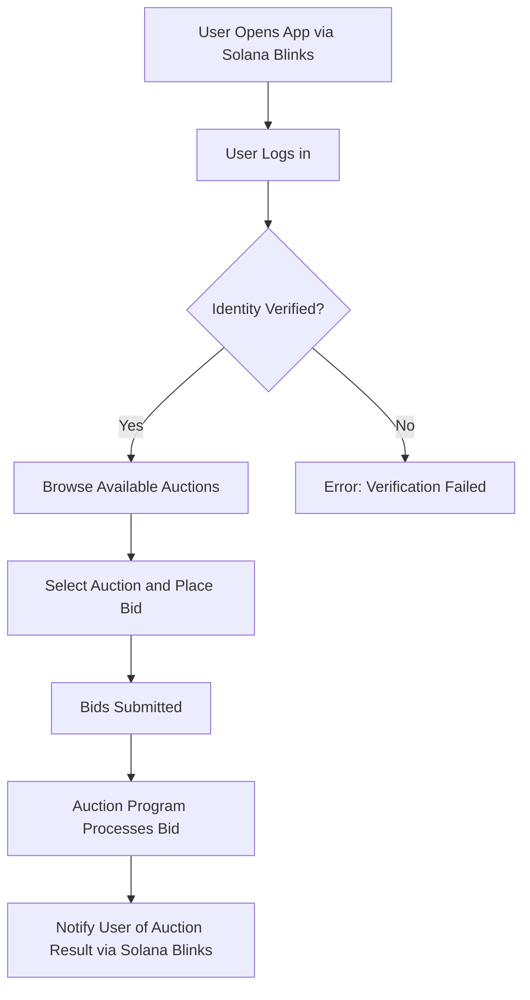

```mermaid
flowchart TD
  User[User Opens App via Solana Blinks] --> Login[User Logs in]
  Login --> Verified{Identity Verified?}
  Verified -- Yes --> BrowseAuctions[Browse Available Auctions]
  Verified -- No --> Error[Error: Verification Failed]
  BrowseAuctions --> SelectAuction[Select Auction and Place Bid]
  SelectAuction --> SubmitBid[Bids Submitted]
  SubmitBid --> AuctionProgram[Auction Program Processes Bid]
  AuctionProgram --> NotifyUser[Notify User of Auction Result via Solana Blinks]
```